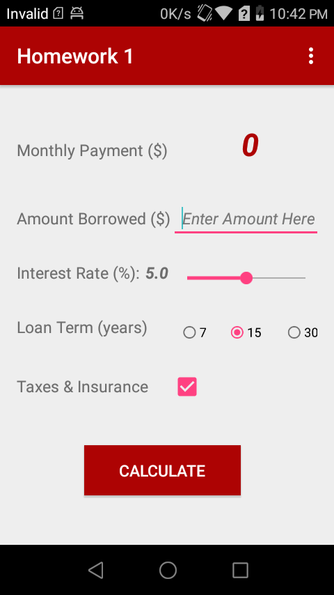

# mortgage-calculator-Android-app

Implemented an mobile app that allows users to calculate monthly payment based on entered data
like amount borrowed, interest rate, loan term, and taxes/insurance.

